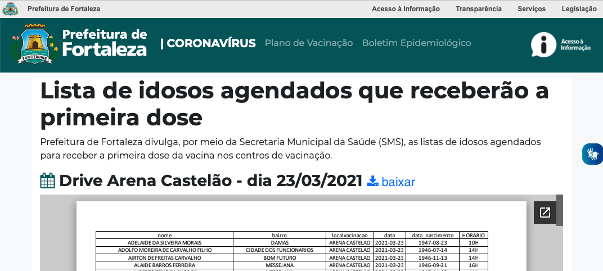

# Introdução

A Prefeitura de Fortaleza-CE divulga, por meio da Secretaria Municipal da Saúde, as listas de agendados, cadastrados e vacinados no portal de informações da prefeitura.

Este script baixa os arquivos PDF que contém a [listas de agendados](https://coronavirus.fortaleza.ce.gov.br/vacinacao.html) da vacina contra o COVID19 em Fortaleza/CE, procura pelo nome dado e envia o resultado da busca para uma conta push bullet através da sua API

Autor: Antonio Alisio de Meneses Cordeiro - alisio.meneses@gmail.com



# Pré-requisitos

## Linux
* Conta [pushbullet](https://www.pushbullet.com)
* [Token de acesso](https://docs.pushbullet.com) do pushbullet
* Computador linux com os seguinte pacotes instalados:
 * Python3
 * pdfgrep
 * wget

## MacOS
* Conta [pushbullet](https://www.pushbullet.com)
* Token de acesso do [pushbullet](https://docs.pushbullet.com)
* Gerenciador de pacotes [homebrew](https://brew.sh)
* Computador Mac com os seguinte pacotes instalados:
 * Python3
 * pdfgrep
 * wget

# Instalação

## Linux

Instalar dependencias (pacotes e bibliotecas) no linux debian like:
```sh
pip install -r requirements.txt
apt install wget pdfgrep
```
## MacOS

Instalar dependencias (pacotes e bibliotecas) no MacOS:
```sh
pip3 install -r requirements.txt
brew install pdfgrep
```

# Configuração

Para obter o token de acesso do pushbullet basta:

1. Acessar e logar no pushbullet pelo browser
1. Clicar na seção 'Settings > Account'
1. Clicar no botão 'Create Access Token'
1. Copiar o token gerado

Conforme ilustrado na animação a seguir:


# Uso:

```sh
./agendacovid19.py -n '<NOME_COMPLETO>' -t '<PUSHBULLET_TOKEN>'
```

Caso exista agendamento para o nome dado, o script enviará as informações para o pushbullet e para a saída padrão, conforme o exemplo a seguir:

```sh
./agendacovid19.py -n 'MARIA DO SOCORRO FULANA SICRANA' -t 'asdkjbadbakjbdbkad '
Mensagem enviada para pushbullet
Encontrado agendamento para MARIA DO SOCORRO FULANA SICRANA: ./arquivos_baixados/03.04Lista_Agendados_03.04.pdf:63.0      MARIA DO SOCORRO FULANA SICRANA                ALDEOTA                UAPS DR. ROBERTO DA SILVA BRUNO        2021-04-03   10:00:00   1   1956-11-19
```

# Limitações:

Testado no Ubuntu 18.04 e no MacOS BigSur

# Melhorias:

Todas. Este script é extremamente simples e tem como alvo não programadores ou
curiosos querendo aprender sobre linux, python e web API.

# Referencias:

* https://coronavirus.fortaleza.ce.gov.br/listaVacinacao.html
* https://docs.pushbullet.com

# Licença

Checar arquivo LICENSE
