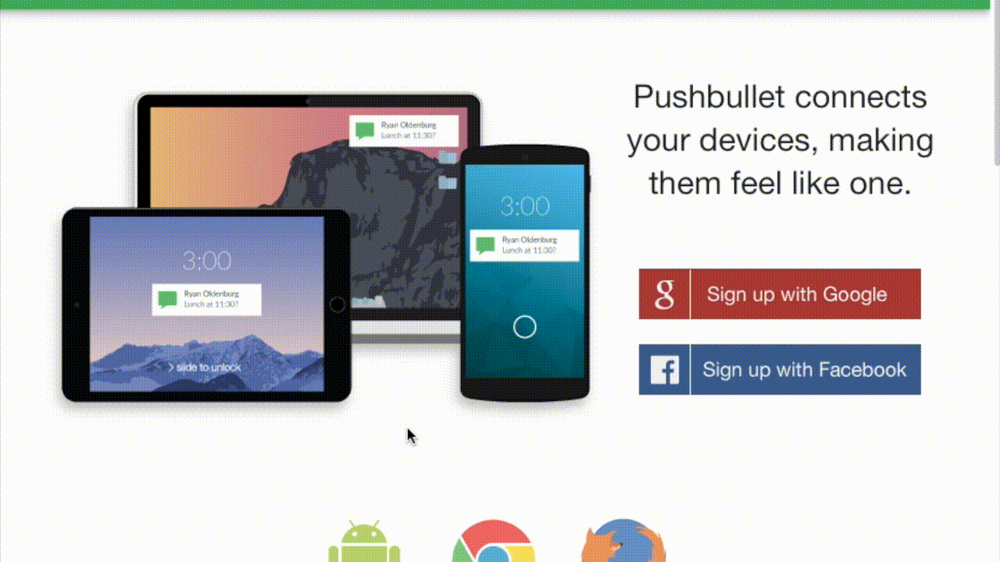

# Introdução

A Prefeitura de Fortaleza-CE divulga, por meio da Secretaria Municipal da Saúde, as listas de agendados, cadastrados e vacinados no portal de informações da prefeitura.

Este script baixa os arquivos PDF que contém a [listas de agendados](https://coronavirus.fortaleza.ce.gov.br/vacinacao.html) da vacina contra o COVID19 em Fortaleza/CE, procura pelo nome dado e envia o resultado da busca para uma conta push bullet através da sua API, ou para um dado mail

Autor: Antonio Alisio de Meneses Cordeiro - alisio.meneses@gmail.com


# Pré-requisitos

## Linux
* Conta [pushbullet](https://www.pushbullet.com)
* [Token de acesso](https://docs.pushbullet.com) do pushbullet
* Computador linux com os seguinte pacotes instalados:
  * Python3
  * pdfgrep
  * wget

## MacOS
* Conta [pushbullet](https://www.pushbullet.com)
* Token de acesso do [pushbullet](https://docs.pushbullet.com) ou [credenciais Oauth2](https://developers.google.com/workspace/guides/create-credentials) para acesso a GMAIL API
* Gerenciador de pacotes [homebrew](https://brew.sh)
* Computador Mac com os seguinte pacotes instalados:
  * Python3
  * pdfgrep
  * wget

# Instalação

## Linux

Instalar dependencias (pacotes e bibliotecas) no linux debian like:
```sh
pip install -r requirements.txt
apt install wget pdfgrep
```
## MacOS

Instalar dependencias (pacotes e bibliotecas) no MacOS:
```sh
pip3 install -r requirements.txt
brew install pdfgrep
```

# Configuração

## Para envio através do pushbullet
Para obter o token de acesso do pushbullet basta:

1. Acessar e logar no pushbullet pelo browser
1. Clicar na seção 'Settings > Account'
1. Clicar no botão 'Create Access Token'
1. Copiar o token gerado

Conforme ilustrado na animação a seguir :



Obs. : O token utilizado na animação não é válido.

## Para envio de emails através da plataforma Google Cloud

1. [Criar um projeto](https://developers.google.com/workspace/guides/create-project) na Google Cloud Platform
1. [habilitar a API](https://developers.google.com/workspace/guides/create-credentials).
1. Baixar JSON das credenciais de acesso à API na mesma pasta deste script com nome `credentials.json`

# Uso:

```sh
./agendacovid19.py -n '<NOME_COMPLETO>' [-t '<PUSHBULLET_TOKEN>' | -m '<emaildedestino@mail.com>']
```

Caso exista agendamento para o nome dado, o script enviará as informações para o pushbullet e para a saída padrão, conforme o exemplo a seguir:

```sh
./agendacovid19.py -n 'MARIA DO SOCORRO FULANA SICRANA' -t 'asdkjbadbakjbdbkad -m fulano@mail.com'
Mensagem enviada para pushbullet
Encontrado agendamento para MARIA DO SOCORRO FULANA SICRANA: ./arquivos_baixados/03.04Lista_Agendados_03.04.pdf:63.0      MARIA DO SOCORRO FULANA SICRANA                ALDEOTA                UAPS DR. ROBERTO DA SILVA BRUNO        2021-04-03   10:00:00   1   1956-11-19
```

## Docker

Uma imagem docker do agendacovid19.fortaleza também está disponível. É necessário instalar
o docker e executar um container baseado na imagem do agendacovid19.
É necessário definir duas variáveis de ambiente para executar o container:
1. O caminho para a pasta de insumos onde serão salvos os arquivos PDF e que deverá conter o arquivo json com as credenciais de acesso ao serviço google cloud
2. O caminho para a pasta que contém o token de acesso à API do gmail (default: ~/.credentials).

Exemplo:

```sh
docker run --rm \
  -v ${PWD}:/insumos \
  -v ${HOME}/.credentials:/root/.credentials \
  -e email=fulano@mail.com \
  -e nome="FULANO SICRANO" \
  agendacovid19

```


# Limitações:

Testado no Ubuntu 18.04 e no MacOS BigSur

# Melhorias:

Todas. Este script é extremamente simples e tem como alvo não programadores ou
curiosos querendo aprender sobre linux, python e web API.

# Referencias:

* https://coronavirus.fortaleza.ce.gov.br/listaVacinacao.html
* https://docs.pushbullet.com
* https://developers.google.com/gmail/api/quickstart/python

# Licença

Checar arquivo LICENSE

# Autor

Antonio Alisio de Meneses Cordeiro - alisio.meneses@gmail.com
